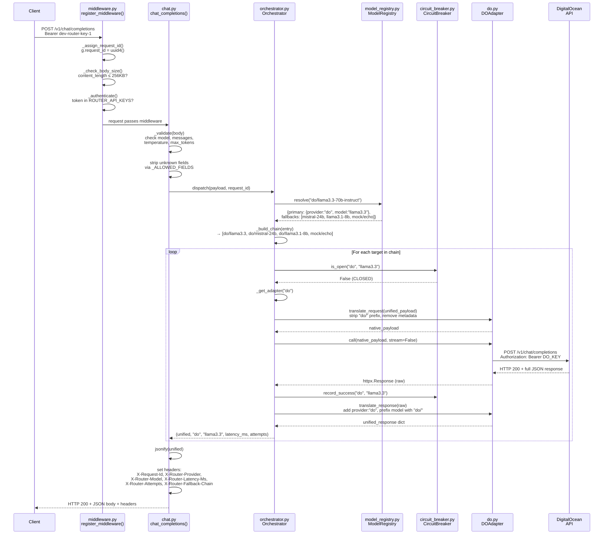
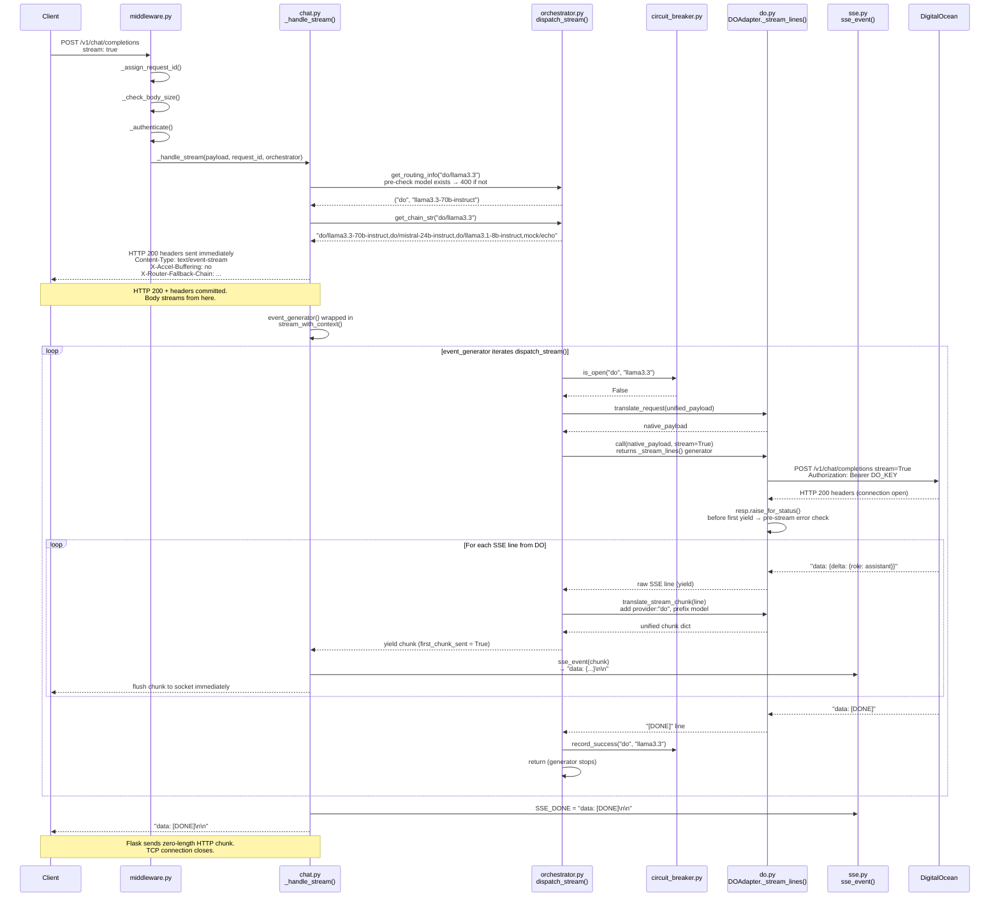
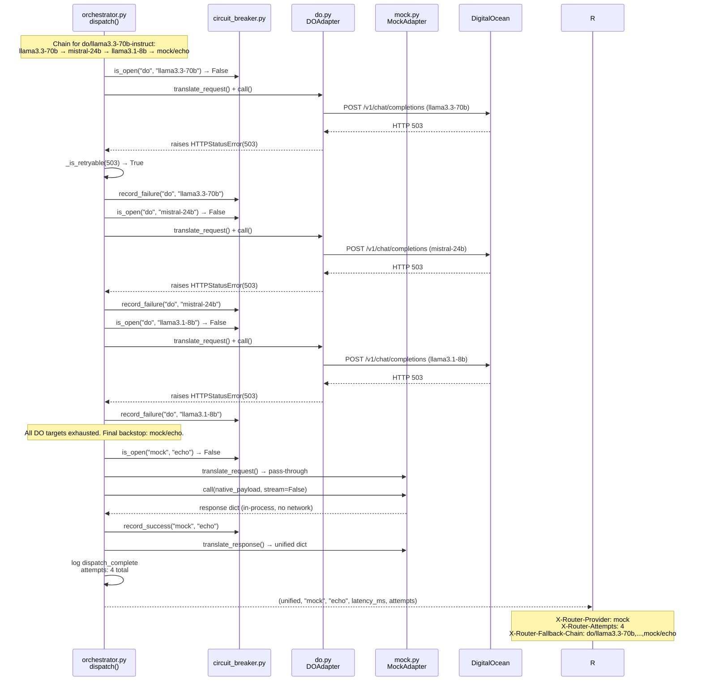
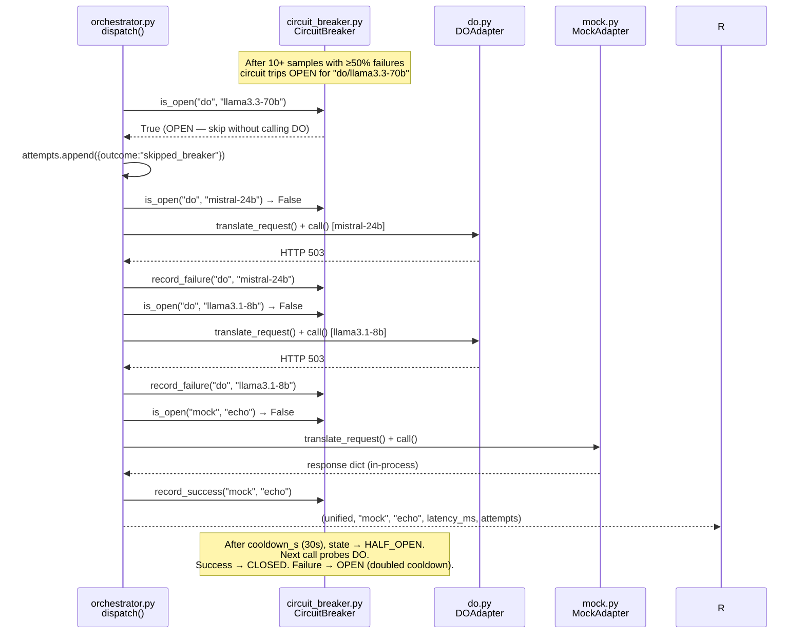
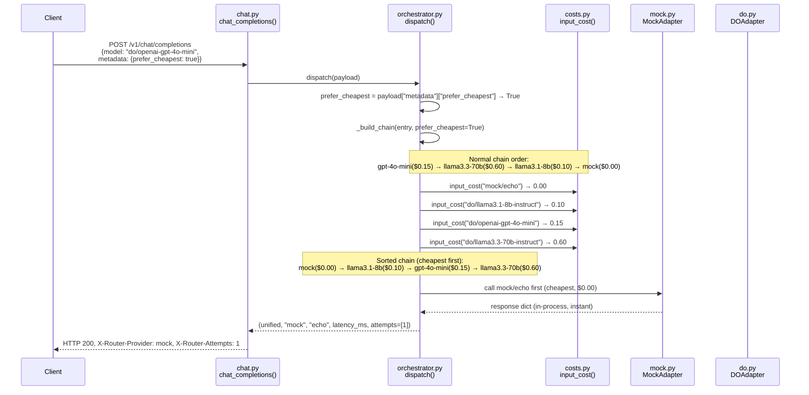
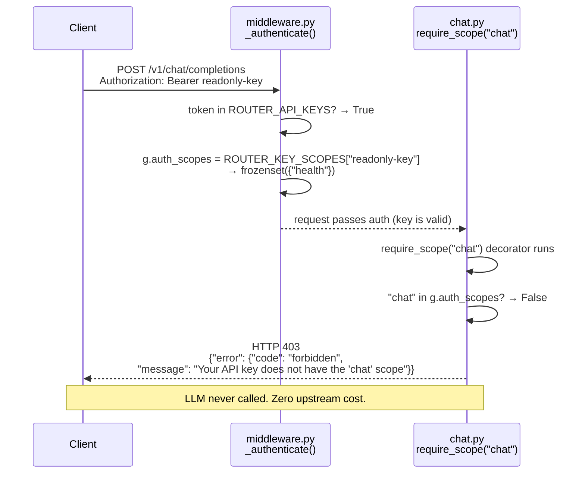

# Sequence Diagrams

Detailed call-execution flows with file names and function names for every major path through the model router.

---

## 1. Non-Streaming: `POST /v1/chat/completions` (stream: false)

---

## 2. Streaming: `POST /v1/chat/completions` (stream: true)

---

## 3. Fallback Path (DO returns 503 → walks 4-level chain → Mock)

---

## 4. Circuit Breaker Opens (repeated failures trip the breaker)

---

## 5. Cost-Aware Routing (`prefer_cheapest: true`)

---

## 6. Auth Scope Rejection (key lacks `chat` scope)

