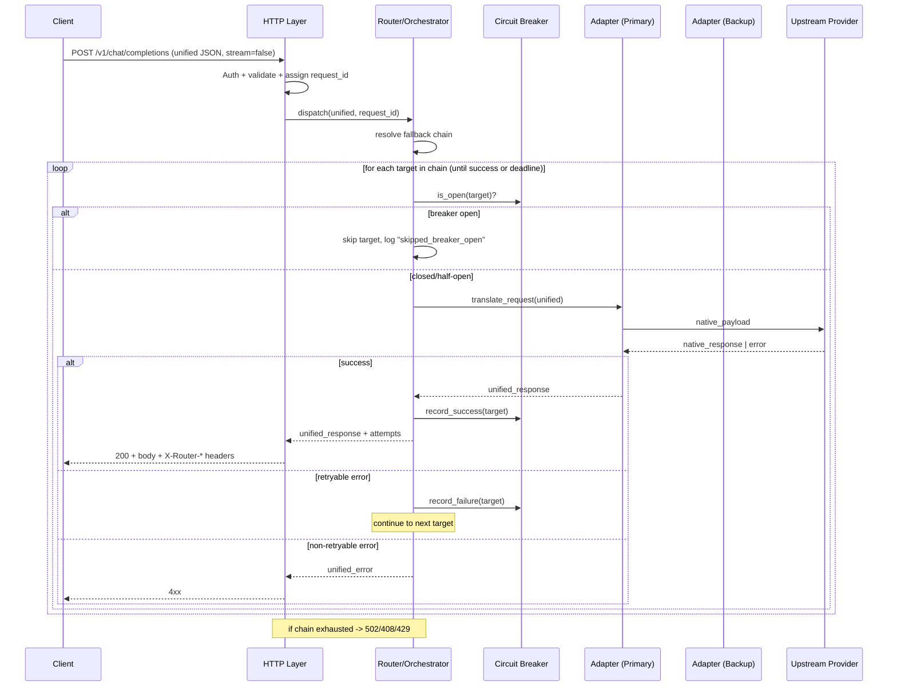
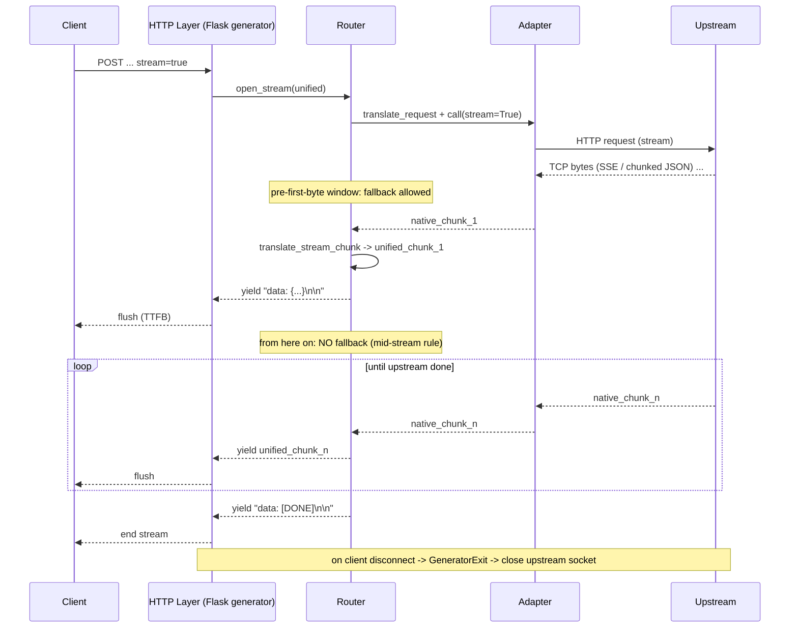

# Unified Model Router — Specification

## 1. Project Summary

Build a **production-ready API gateway** acting as a **Unified Model Router**
(similar to OpenRouter).

The gateway must:

- Accept a **standardized inference schema** from clients.
- **Dynamically route** each request to a real upstream LLM provider
  (e.g. OpenAI, Anthropic, Google Gemini, Mistral, local Ollama, …).
- **Proxy live streaming chunks** back to the client in real time.
- Execute **clean, silent fallbacks** to alternate providers/models when a
  primary target fails (timeout, 5xx, rate-limit, malformed response, etc.) —
  the client must not observe the failure beyond normal latency.

Non-functional pillars baked in from day one:

- **Security**: API-key auth, secret isolation, strict input validation,
  request size limits, CORS hardening.
- **Privacy**: no logging of prompt/response bodies by default; PII-safe
  structured logs; configurable redaction.
- **Compliance**: auditable request trail (request_id, route taken, fallback
  chain, token usage), retention policies via config.
- **Reliability**: timeouts, retries with jitter, circuit breaking, graceful
  degradation.
- **Observability**: `/health`, structured JSON logs, request correlation IDs,
  per-provider metrics.
- **Performance**: parallel fan-out where applicable, async/threaded upstream
  calls, streaming with backpressure.

---

## 2. Functional Requirements

### F1. Unified API & Schema Translation

#### F1.1 Goal
Expose a single, OpenAI-compatible endpoint that hides provider-specific
payload shapes from the client. The router accepts **one unified schema**,
translates it to the upstream provider's native schema, calls the provider,
then remaps the response back to the unified schema.

#### F1.2 Endpoint

```
POST /v1/chat/completions
```

- **Auth**: `Authorization: Bearer <ROUTER_API_KEY>` (router-issued key, not
  the upstream provider key).
- **Content-Type**: `application/json`.
- **Idempotency**: optional `Idempotency-Key` header (reserved for later).
- **Correlation**: server generates `X-Request-Id` if absent; always returned
  in the response headers.

#### F1.3 Unified Request Schema (inbound)

OpenAI Chat Completions–compatible. Minimal v1 surface:

```jsonc
{
  "model": "string",                 // required — unified model id, e.g. "openai/gpt-4o-mini"
  "messages": [                      // required — non-empty
    { "role": "system|user|assistant|tool", "content": "string" }
  ],
  "temperature": 0.0..2.0,           // optional, default 1.0
  "top_p": 0.0..1.0,                 // optional, default 1.0
  "max_tokens": int > 0,             // optional
  "stream": true|false,              // optional, default false
  "stop": "string" | ["string"],     // optional
  "user": "string",                  // optional, opaque end-user identifier
  "metadata": { "k": "v" }           // optional, passed through to logs only
}
```

Validation rules:
- Reject if `model` missing/unknown → `400` with `error.code = "model_not_found"`.
- Reject if `messages` missing/empty → `400` with `error.code = "invalid_request"`.
- Enforce request body size limit (default **256 KB**, configurable).
- Strip unknown top-level fields (do **not** forward to upstream unless mapped).

#### F1.4 Unified Response Schema (non-streaming)

OpenAI-compatible:

```jsonc
{
  "id": "chatcmpl_<uuid>",
  "object": "chat.completion",
  "created": 1719450000,
  "model": "openai/gpt-4o-mini",        // unified model id actually served
  "provider": "openai",                  // router extension — which upstream answered
  "choices": [
    {
      "index": 0,
      "message": { "role": "assistant", "content": "..." },
      "finish_reason": "stop|length|tool_calls|content_filter"
    }
  ],
  "usage": {
    "prompt_tokens": 0,
    "completion_tokens": 0,
    "total_tokens": 0
  }
}
```

Response headers:
- `X-Request-Id`
- `X-Router-Provider` (upstream actually used)
- `X-Router-Model` (upstream model name actually called)
- `X-Router-Latency-Ms`

#### F1.5 Unified Response Schema (streaming, F1 stub)

When `stream: true`, respond `text/event-stream` with OpenAI-style SSE chunks:

```
data: {"id":"...","object":"chat.completion.chunk","choices":[{"index":0,"delta":{"content":"..."}}]}
...
data: [DONE]
```

(Streaming is fully covered in a later functional section; in F1 we only
guarantee the **schema shape** of chunks.)

#### F1.6 Provider Adapter Contract

Each upstream provider is implemented as an **adapter** that satisfies:

```python
class BaseAdapter:
    name: str                                  # "openai", "anthropic", ...
    def translate_request(unified: dict) -> dict: ...    # unified → native
    def call(native_payload: dict, *, stream: bool) -> Any: ...
    def translate_response(native_response: Any) -> dict: ...   # native → unified
    def translate_stream_chunk(native_chunk: Any) -> dict | None: ...
```

Mapping rules per provider (v1 targets):

| Field            | OpenAI                  | Anthropic                                  | Gemini                                |
|------------------|-------------------------|--------------------------------------------|---------------------------------------|
| `model`          | `model` (strip prefix)  | `model` (strip prefix)                     | `model` (strip prefix)                |
| `messages`       | `messages` as-is        | split `system` → top-level `system`; rest → `messages` | convert to `contents[].parts[].text`  |
| `temperature`    | `temperature`           | `temperature`                              | `generationConfig.temperature`        |
| `max_tokens`     | `max_tokens`            | `max_tokens` (required by Anthropic)       | `generationConfig.maxOutputTokens`    |
| `stop`           | `stop`                  | `stop_sequences`                           | `generationConfig.stopSequences`      |
| `stream`         | `stream`                | `stream`                                   | use `:streamGenerateContent` URL      |
| response text    | `choices[0].message`    | `content[0].text`                          | `candidates[0].content.parts[0].text` |
| usage            | `usage.*`               | `usage.input_tokens / output_tokens`       | `usageMetadata.*TokenCount`           |
| finish reason    | `choices[0].finish_reason` | `stop_reason` (map values)              | `candidates[0].finishReason` (map)    |

`finish_reason` normalization → `stop | length | tool_calls | content_filter | error`.

#### F1.7 Model ID Convention

Unified model ids use `"<provider>/<model>"`:

- `openai/gpt-4o-mini`
- `anthropic/claude-3-5-sonnet`
- `google/gemini-1.5-flash`

The router uses the **prefix** to pick the adapter and the **suffix** as the
native model name (with per-provider overrides allowed in the model registry).

#### F1.8 Error Model

All errors return a unified body and appropriate HTTP status:

```jsonc
{
  "error": {
    "code": "invalid_request | model_not_found | unauthorized | upstream_error | upstream_timeout | rate_limited | internal_error",
    "message": "human readable",
    "type": "router | upstream",
    "request_id": "..."
  }
}
```

Status mapping:
- `400` invalid_request / model_not_found
- `401` unauthorized
- `408` upstream_timeout (when no fallback succeeds)
- `429` rate_limited
- `502` upstream_error (final, post-fallback)
- `500` internal_error

(Fallback behavior itself is specified in a later functional section; F1 only
defines the **error shape**.)

#### F1.9 Out of Scope for F1

The following are **explicitly deferred** to later functional sections and
will be appended to this spec as we build them:

- Dynamic routing policies (cost/latency/health-based).
- Parallel fan-out / best-of-N.
- Rate limiting, quotas, caching.
- Usage accounting & billing exports.

#### F1.10 Acceptance Criteria (F1)

1. `POST /v1/chat/completions` with a valid unified payload + known model id
   returns a `200` unified response whose `provider` and `model` fields
   reflect the upstream actually called.
2. Same unified payload, when sent with `openai/...`, `anthropic/...`, and
   `google/...` model ids, returns **schema-identical** unified responses
   (only `provider`, `model`, and content differ).
3. Invalid payloads return the unified error envelope with correct codes and
   HTTP statuses.
4. Unknown `model` returns `400 model_not_found`.
5. No upstream-specific field names leak into the response body.
6. Unit tests cover request translation and response remapping for every
   adapter with recorded provider fixtures (no live network in CI).

---

### F2. Server-Sent Events (SSE) Streaming

#### F2.1 Goal
When the client sets `stream: true`, the router must relay tokens from the
upstream provider to the client **as they arrive**, using Server-Sent Events
over chunked transfer encoding, **without buffering the full response in
memory**. The router is a true pipe: upstream-bytes-in → unified-chunks-out.

#### F2.2 Wire Protocol

- Response status: `200 OK`
- Response headers:
  - `Content-Type: text/event-stream; charset=utf-8`
  - `Cache-Control: no-cache, no-transform`
  - `Connection: keep-alive`
  - `X-Accel-Buffering: no`               *(disable proxy buffering, e.g. nginx)*
  - `Transfer-Encoding: chunked`           *(set by WSGI/HTTP layer)*
  - `X-Request-Id`, `X-Router-Provider`, `X-Router-Model`
- Body: a sequence of SSE events, each terminated by `\n\n`:

```
data: {"id":"chatcmpl_...","object":"chat.completion.chunk","created":1719450000,"model":"openai/gpt-4o-mini","provider":"openai","choices":[{"index":0,"delta":{"role":"assistant"},"finish_reason":null}]}

data: {"id":"chatcmpl_...","object":"chat.completion.chunk","choices":[{"index":0,"delta":{"content":"Hel"},"finish_reason":null}]}

data: {"id":"chatcmpl_...","object":"chat.completion.chunk","choices":[{"index":0,"delta":{"content":"lo"},"finish_reason":null}]}

data: {"id":"chatcmpl_...","object":"chat.completion.chunk","choices":[{"index":0,"delta":{},"finish_reason":"stop"}],"usage":{"prompt_tokens":12,"completion_tokens":2,"total_tokens":14}}

data: [DONE]

```

Rules:
- The **first** event must carry the `role` delta (`"role":"assistant"`).
- Content deltas carry `delta.content`.
- The **final** chunk carries `finish_reason` and (best-effort) `usage`.
- Stream is terminated by the literal sentinel `data: [DONE]\n\n`.
- Keep-alive comments (`: ping\n\n`) may be emitted every 15s of silence.

#### F2.3 Streaming Pipeline (no full-buffering)

1. Validate request, pick adapter (same as F1).
2. Open upstream call with `stream=True` using a **streaming HTTP client**
   (`requests` with `stream=True`, or `httpx` streaming). Connection pool
   per provider, reused across requests.
3. Iterate upstream response **line-by-line / event-by-event**:
   - OpenAI/Anthropic: SSE — iterate `iter_lines()`, parse `data: ...`.
   - Gemini `streamGenerateContent`: chunked JSON array — iterate as JSON
     deltas.
4. For each native chunk, call `adapter.translate_stream_chunk(...)`. If it
   returns `None`, skip. Otherwise serialize to `data: <json>\n\n` and yield
   immediately.
5. Flask response uses a **generator** (`Response(stream_with_context(gen()), …)`)
   so bytes flush to the socket as yielded. **No `list()` or `"".join()`** on
   the upstream iterator anywhere in the path.
6. On generator end, yield `data: [DONE]\n\n` and close upstream connection
   in `finally`.

#### F2.4 Backpressure, Timeouts, Cancellation

- **Connect timeout** and **read timeout** are separate and configurable
  per provider (defaults: connect 5s, read-idle 30s).
- If the client disconnects (broken pipe / `GeneratorExit`), the router
  **must** close the upstream connection promptly to free the slot.
- Read-idle timeout aborts a stalled stream and triggers fallback (see F3)
  **only if no chunk has been emitted yet**; once even one delta has been
  flushed to the client, the stream cannot fall back (it would corrupt the
  visible output) — instead the stream is terminated cleanly with
  `finish_reason: "error"` in a final chunk + `[DONE]`.

#### F2.5 Privacy & Logging

- Do **not** log chunk contents.
- Log one structured event per stream: `{request_id, provider, model,
  started_at, first_byte_ms, total_ms, chunks, bytes_out, finish_reason,
  client_disconnect: bool}`.

#### F2.6 Out of Scope for F2

- Tool/function-call streaming deltas (deferred).
- Multi-choice (`n > 1`) streaming (v1 supports `n = 1` only).

#### F2.7 Acceptance Criteria (F2)

1. `stream: true` returns `text/event-stream` with the documented headers
   and the documented event sequence, ending in `data: [DONE]`.
2. Time-to-first-byte (TTFB) ≤ upstream TTFB + 50 ms (no full buffering).
3. A 10 MB-equivalent stream never grows router RSS by more than ~2 MB
   while in flight (smoke test with a long mock stream).
4. Killing the client mid-stream closes the upstream socket within 1 s
   (observable in adapter logs / mock).
5. Unified chunk schema is identical across OpenAI/Anthropic/Gemini for the
   same logical content.
6. Tests assert: chunk schema, ordering (role-first, content middle,
   finish-last, `[DONE]` terminator), and no-buffering (mock upstream
   yields with sleeps; client receives interleaved).

---

### F3. Resilient Fallback Routing

#### F3.1 Goal
When the **primary** provider/model fails with a transient error, the router
**transparently** switches to a **backup** target and serves the response —
streaming or not — **without the client observing the failure**. The client
sees one successful response; the fallback is invisible in the body and only
visible via opt-in response headers and server-side audit logs.

#### F3.2 Fallback Chain

Each unified model id resolves, via the **model registry**, to an ordered
**fallback chain**:

```jsonc
{
  "openai/gpt-4o-mini": {
    "primary":   { "provider": "openai",    "model": "gpt-4o-mini" },
    "fallbacks": [
      { "provider": "anthropic", "model": "claude-3-5-haiku" },
      { "provider": "google",    "model": "gemini-1.5-flash" }
    ]
  }
}
```

- Chain order is deterministic per request unless overridden by routing
  policy (deferred functional section).
- Max chain length is bounded (default **3**, configurable) to cap tail
  latency.
- Per-attempt **timeout budget** and a **global request deadline** (default
  60 s) are enforced; once the deadline is exceeded, no further attempts.

#### F3.3 Retryable vs Non-Retryable Failures

**Retryable (trigger fallback to next target):**

| Condition                                  | Detection                                  |
|--------------------------------------------|--------------------------------------------|
| HTTP `408`, `425`, `429`, `500`, `502`, `503`, `504` | Upstream status code               |
| Connect timeout / DNS error                | Transport exception                        |
| Read-idle timeout **before first chunk**   | No bytes within read-idle window           |
| Connection reset / TLS error               | Transport exception                        |
| Malformed/unparseable upstream body        | Adapter parse error                        |
| Provider explicit `overloaded_error` / `service_unavailable` JSON | Adapter inspection |

**Non-retryable (return error to client immediately, no fallback):**

| Condition                                  | Reason                                     |
|--------------------------------------------|--------------------------------------------|
| HTTP `400` (bad payload)                   | Client error — fallback won't help         |
| HTTP `401` / `403`                         | Auth misconfig — fix at router, not retry  |
| HTTP `404` model_not_found at provider     | Permanent for that target only → **is** retryable to next target, but not retried against same target |
| Content-filter / safety block (`finish_reason: content_filter`) | Policy decision, not a failure |
| Client disconnect                          | No one to serve                            |

Per-attempt retry of the **same** target is **disabled by default** for v1
(jittered single retry can be enabled per provider in config). Fallback
moves to the **next** target.

#### F3.4 Streaming Fallback Rule (critical)

Fallback during a streaming response is allowed **only before the first
content byte has been flushed to the client**. Once the client has received
any `delta.content`, the router **must not** switch providers (output would
become incoherent). In that case the stream terminates with a final chunk
carrying `finish_reason: "error"` followed by `[DONE]`.

This means:
- Pre-first-byte transient errors → silent fallback to next target.
- Mid-stream upstream failure → clean stream termination, **no fallback**,
  logged as `mid_stream_failure`.

#### F3.5 Silent to Client, Auditable to Operator

- Response body is **always** the unified success schema on a successful
  attempt; no mention of prior failures.
- Response headers (opt-in via config flag `expose_routing_headers`, default
  **on** for non-prod, **off** for prod):
  - `X-Router-Attempts: 2`
  - `X-Router-Fallback-Chain: openai/gpt-4o-mini,anthropic/claude-3-5-haiku`
  - `X-Router-Provider: anthropic`  *(target that actually answered)*
- Always logged server-side (structured):
  ```json
  {
    "request_id": "...",
    "unified_model": "openai/gpt-4o-mini",
    "attempts": [
      {"provider":"openai","model":"gpt-4o-mini","outcome":"error","error_class":"http_502","latency_ms":812},
      {"provider":"anthropic","model":"claude-3-5-haiku","outcome":"success","latency_ms":640}
    ],
    "total_latency_ms": 1452,
    "served_by": "anthropic"
  }
  ```

#### F3.6 Circuit Breaker (lightweight, v1)

Per `(provider, model)` target, maintain a rolling failure window:

- If failure rate ≥ **50 %** over the last **20** attempts (min 10 samples),
  open the breaker for **30 s** → router skips this target and goes straight
  to the next in the chain.
- Half-open: after cooldown, allow **1** probe; success closes breaker,
  failure re-opens for 60 s (exponential up to 5 min).
- Breaker state is in-process for v1 (Redis-backed in a later section).

#### F3.7 Exhausted Chain

If every target in the chain fails (or is breaker-open), return the unified
error envelope from F1.8 with:

- HTTP `502` and `error.code = "upstream_error"` (general transient),
- or `408` `upstream_timeout` if all failures were timeouts,
- or `429` `rate_limited` if all failures were 429s.

`error.message` is generic; details only in server logs.

#### F3.8 Configuration Surface

```yaml
routing:
  request_deadline_ms: 60000
  max_fallbacks: 3
  expose_routing_headers: true
  per_provider:
    openai:
      connect_timeout_ms: 5000
      read_idle_timeout_ms: 30000
      retry_same_target: 0
    anthropic: { ... }
    google: { ... }
circuit_breaker:
  window_size: 20
  min_samples: 10
  failure_rate_open: 0.5
  cooldown_ms: 30000
```

#### F3.9 Out of Scope for F3

- Cost-/latency-aware **policy** selection (we use static chains in F3;
  smart routing is a later section).
- Cross-instance breaker state (Redis).
- Hedged requests (start backup before primary failure).

#### F3.10 Acceptance Criteria (F3)

1. With primary mocked to return `503`, a non-streaming request still
   returns `200` with the unified schema; `X-Router-Provider` reflects the
   backup; logs show 2 attempts.
2. With primary mocked to return `503` on a `stream: true` request, the
   client sees a single clean SSE stream from the backup, ending with
   `[DONE]`; no error chunk; first attempt is invisible to the client body.
3. With primary mocked to **stream one chunk then die**, the client
   receives that one chunk, then a final `finish_reason: "error"` chunk and
   `[DONE]`; no fallback is attempted (mid-stream rule).
4. With **all** targets failing transiently, the client receives a unified
   `502 upstream_error` (or `408` if all timeouts), and the audit log lists
   every attempt.
5. After N consecutive failures on a target, the circuit breaker opens and
   subsequent requests skip that target until cooldown elapses.
6. A `400` (bad payload) from the primary is **not** retried against the
   backup — the client gets `400` immediately.
7. Unit + integration tests cover: retryable status codes, non-retryable
   status codes, streaming pre-first-byte fallback, streaming mid-stream
   abort, exhausted chain, breaker open/half-open/close transitions.

---

## 3. Engineering Expectations

### E1. Architecture & Flow

#### E1.1 Layered Architecture

The codebase is split into hard layers so **routing logic** is independent
of any **vendor payload variation**. Vendor differences live only inside
adapters; the rest of the system speaks the unified schema.

```
+------------------------------------------------------------------+
|                          HTTP Layer (Flask)                      |
|  - Blueprints: /health, /v1/chat/completions                     |
|  - Auth middleware, request-id, size limits, JSON validation     |
+------------------------------------------------------------------+
                              |
                              v
+------------------------------------------------------------------+
|                       Router / Orchestrator                      |
|  - Resolve unified model -> fallback chain (Model Registry)      |
|  - Apply circuit breaker, deadline, attempt loop                 |
|  - Choose stream vs non-stream branch                            |
|  - Emit structured audit log of attempts                         |
+------------------------------------------------------------------+
                              |
                              v
+------------------------------------------------------------------+
|                      Provider Adapter (per vendor)               |
|  BaseAdapter:                                                    |
|    translate_request(unified)        -> native_payload           |
|    call(native_payload, stream=...)  -> response | iterator      |
|    translate_response(native)        -> unified                  |
|    translate_stream_chunk(native)    -> unified_chunk | None     |
|  Concrete: OpenAIAdapter, AnthropicAdapter, GeminiAdapter, Mock  |
+------------------------------------------------------------------+
                              |
                              v
+------------------------------------------------------------------+
|                       Upstream HTTP Client                       |
|  - httpx/requests Session per provider (connection pool)         |
|  - separate connect & read-idle timeouts, TLS, retries off       |
+------------------------------------------------------------------+
```

Cross-cutting modules: `config`, `logging`, `errors`, `metrics`,
`circuit_breaker`, `model_registry`.

#### E1.2 Request Flow — Non-Streaming



#### E1.3 Request Flow — Streaming (Pipe)



#### E1.4 Separation of Routing from Vendor Payloads

- The **Router** never reads or writes a vendor-specific field. It only
  consumes the **unified schema** and the **adapter interface**.
- Each **Adapter** owns 100 % of vendor knowledge:
  - URL, headers, auth scheme.
  - Request field mapping (table in F1.6).
  - Response/stream parsing.
  - Error classification (`is_retryable(exc_or_status) -> bool`).
- Adapters are registered in a `ProviderRegistry` keyed by `provider` name,
  injected into the Router at app startup → **plug-in style**; adding a new
  provider = adding one file, zero changes to Router.

#### E1.5 Module Layout

```
model-router/
├── app/
│   ├── __init__.py            # create_app()
│   ├── config.py              # env-driven settings, validated at boot
│   ├── errors.py              # unified error envelope + exceptions
│   ├── logging_setup.py       # structured JSON logging
│   ├── middleware.py          # auth, request_id, body-size limit
│   ├── routes/
│   │   ├── health.py
│   │   └── chat.py            # POST /v1/chat/completions
│   ├── router/
│   │   ├── orchestrator.py    # attempt loop, deadline, fallback
│   │   ├── circuit_breaker.py
│   │   └── model_registry.py  # unified_model -> chain
│   ├── adapters/
│   │   ├── base.py            # BaseAdapter ABC
│   │   ├── openai.py
│   │   ├── anthropic.py
│   │   ├── gemini.py
│   │   └── mock.py            # deterministic, scriptable, for tests
│   └── streaming/
│       └── sse.py             # SSE framing helpers, keep-alive
├── tests/
│   ├── unit/
│   └── integration/
├── .github/workflows/ci.yml
├── requirements.txt
├── pytest.ini
├── README.md
├── spec.md
└── wsgi.py
```

---

### E2. Stream & Connection Management

#### E2.1 Partial / Malformed Streams

- Each adapter parses upstream chunks **incrementally** with a tolerant
  parser (line-buffered for SSE, JSON-lines or array-streaming for Gemini).
- Unparseable chunk → **drop the chunk**, increment `malformed_chunks`
  counter, continue. Do **not** kill the stream for a single bad frame.
- If unparseable chunks exceed `max_malformed_chunks` (default 5) or
  occupy > 25 % of received chunks, treat as upstream failure:
  - Pre-first-byte: trigger fallback (F3.4).
  - Mid-stream: terminate with `finish_reason:"error"` + `[DONE]`.
- Truncated upstream (EOF before terminator):
  - Pre-first-byte: fallback.
  - Mid-stream: emit a synthetic final chunk `finish_reason:"length"` if any
    content was sent, then `[DONE]`. Log `truncated_upstream=true`.

#### E2.2 Client Disconnect Mid-Generation

- Flask raises `GeneratorExit` (or socket write fails with broken pipe) when
  the client closes the connection.
- The streaming generator wraps the upstream iteration in `try / finally`:
  - `finally` always calls `upstream_response.close()` (and underlying
    socket close via the HTTP client), releasing the pool slot **within
    1 s** of client disconnect.
  - A `client_disconnect=true` field is added to the per-stream audit log;
    no error is reported to the (now-gone) client.
- The router does **not** continue draining the upstream after client
  disconnect (wastes tokens and quota).

#### E2.3 Target Connection Timeout Strategy

Three independent timeouts, all configurable per provider:

| Timeout              | Default | Trigger                                            | Action                                            |
|----------------------|---------|----------------------------------------------------|---------------------------------------------------|
| `connect_timeout_ms` | 5 000   | TCP/TLS handshake exceeds budget                   | Classify retryable → fallback                     |
| `read_idle_timeout_ms` | 30 000 | No bytes received from upstream for this duration  | Pre-first-byte: retryable → fallback. Mid-stream: terminate with error chunk |
| `request_deadline_ms`  | 60 000 | Total wall-clock since router accepted the request | Stop attempting further targets; return exhausted-chain error |

Additional safeguards:

- **TCP keepalive** enabled on upstream sockets (idle 30 s, intvl 10 s).
- **No automatic same-target retry** in the HTTP client (handled by
  orchestrator only) to avoid double-charging tokens.
- **HTTP/2** allowed when the provider supports it (httpx), but not
  required.

#### E2.4 Backpressure

- The generator yields **synchronously**; Flask/WSGI writes to the socket;
  if the client is slow, the OS TCP buffer fills, `send()` blocks, the
  generator pauses, and the upstream iterator naturally pauses too (we do
  not pre-pull). This gives end-to-end backpressure without explicit
  queues.
- We never spawn a producer thread that buffers chunks into a queue (would
  break backpressure and risk OOM on a slow client + fast upstream).

#### E2.5 Resource Caps

- Per-provider `httpx.Client` with a bounded pool (`max_connections=100`,
  `max_keepalive=20` by default).
- Global in-flight request gauge; if it exceeds a configurable cap, new
  requests get `429 rate_limited` from the router itself (defense in depth
  against the dev process getting wedged).

---

### E3. Testing Strategy

Goals: every spec rule has at least one test; **no test calls a real
provider**; CI is hermetic and fast (< 30 s).

#### E3.1 Test Tiers

- **Unit tests** (`tests/unit/`): pure functions and small classes.
  - Adapter `translate_request` / `translate_response` /
    `translate_stream_chunk` against recorded fixtures.
  - Error classifier (`is_retryable`).
  - Circuit breaker state machine (open / half-open / close with
    deterministic time injection).
  - Model registry resolution.
  - SSE framing helpers (DONE terminator, keep-alive comments).

- **Integration tests** (`tests/integration/`): Flask test client + a
  **mock upstream** that scripts status codes, latencies, chunk sequences,
  and disconnects.
  - F1: end-to-end unified request → unified response across all adapters
    with mocked upstreams.
  - F2: SSE byte sequence, ordering invariants, `[DONE]` terminator, no
    full buffering (assert chunks arrive interleaved with mock sleeps),
    client disconnect closes upstream within 1 s.
  - F3: pre-first-byte fallback (transparent to client), mid-stream abort
    (no fallback, clean error chunk + DONE), exhausted chain, breaker
    open/half-open/close, `400` not retried, content-filter not retried.
  - E2.1: malformed-chunk tolerance threshold; truncated stream handling.

- **Contract tests**: golden JSON fixtures for each provider's request &
  response payloads under `tests/fixtures/<provider>/`. Updating a
  provider mapping requires updating its fixtures (gates accidental
  breakage of the unified schema).

- **Smoke test** (`tests/smoke/test_health.py`): `/health` returns 200
  with required fields (already in place).

#### E3.2 Tooling

- `pytest`, `pytest-cov`, `pytest-httpx` (or `responses` for `requests`),
  `freezegun` for time, `hypothesis` (optional) for SSE parser fuzzing.
- Coverage target: **≥ 85 %** on `app/router/*`, `app/adapters/*`,
  `app/streaming/*`. Reported in CI; PR fails if it drops > 2 %.

#### E3.3 Conventions

- Tests are **deterministic** — no `sleep` longer than needed; inject a
  clock into circuit breaker.
- Tests are **isolated** — no shared global state; each test builds its
  own `create_app()` instance with a test config.
- **Real network is forbidden** in CI; a conftest-level autouse fixture
  patches `httpx`/`requests` to raise if a non-mocked host is contacted.

---

### E4. CI / CD (GitHub Actions)

#### E4.1 Pipeline Spec — `.github/workflows/ci.yml`

Triggers: `push` to any branch, `pull_request` to `main`.

Jobs (matrix on Python 3.11 + 3.12):

1. **lint**
   - `ruff check .`
   - `ruff format --check .`
2. **type-check**
   - `mypy app/` (strict for `app/router` and `app/adapters`).
3. **test**
   - `pip install -r requirements.txt -r requirements-dev.txt`
   - `pytest -q --cov=app --cov-report=xml --cov-fail-under=85`
4. **security**
   - `pip-audit` (vulnerable deps)
   - `bandit -q -r app/` (common Python sec issues)
5. **build** (only on `main` or tags)
   - Build Docker image, run `docker run ... /health` smoke check, push to
     GHCR when on tag `v*`.

Caching: `actions/setup-python` with pip cache keyed on
`requirements*.txt`.

Branch protection on `main`: lint + type-check + test + security must
pass.

#### E4.2 Local Equivalent

A `make ci` target (or `scripts/ci.sh`) runs the exact same commands so
contributors can reproduce CI failures locally.

---

### E5. Documentation — README

`README.md` at repo root must cover, in order:

1. **What it is** — one-paragraph summary + link to `spec.md`.
2. **Architecture** — embed the diagrams from §E1.2 / §E1.3 (or link).
3. **Local Deployment**:
   - Prereqs (Python ≥ 3.11).
   - `python -m venv .venv && source .venv/bin/activate`
   - `pip install -r requirements.txt`
   - `cp .env.example .env` and edit.
   - Run: `python wsgi.py` (dev) or
     `gunicorn -w 4 -k gthread -b 0.0.0.0:8000 wsgi:app` (prod-ish).
4. **Configuration** — table of every env var: name, default, description,
   sensitivity flag (e.g. `OPENAI_API_KEY` = secret).
5. **API Key Setup**:
   - Router-issued keys (how to add to `ROUTER_API_KEYS`).
   - Upstream provider keys (`OPENAI_API_KEY`, `ANTHROPIC_API_KEY`,
     `GOOGLE_API_KEY`) — never logged, never returned, never echoed.
6. **API Reference** — link to spec.md §F1 schema; brief table of endpoints.
7. **Sample `curl` commands**:

   - **Health**
     ```bash
     curl -s http://localhost:8000/health
     ```

   - **Non-streaming chat completion**
     ```bash
     curl -s http://localhost:8000/v1/chat/completions \
       -H "Authorization: Bearer $ROUTER_API_KEY" \
       -H "Content-Type: application/json" \
       -d '{
             "model": "openai/gpt-4o-mini",
             "messages": [{"role":"user","content":"Hello"}]
           }'
     ```

   - **Streaming (SSE)** — note `--no-buffer` and `-N`:
     ```bash
     curl -N --no-buffer http://localhost:8000/v1/chat/completions \
       -H "Authorization: Bearer $ROUTER_API_KEY" \
       -H "Content-Type: application/json" \
       -d '{
             "model": "openai/gpt-4o-mini",
             "stream": true,
             "messages": [{"role":"user","content":"Stream a short poem"}]
           }'
     ```

   - **Forcing the mock provider** (offline dev):
     ```bash
     curl -N --no-buffer http://localhost:8000/v1/chat/completions \
       -H "Authorization: Bearer $ROUTER_API_KEY" \
       -H "Content-Type: application/json" \
       -d '{"model":"mock/echo","stream":true,"messages":[{"role":"user","content":"hi"}]}'
     ```

8. **Testing** — `pytest -q`, coverage, how to run integration only.
9. **Troubleshooting** — common errors (`401`, `400 model_not_found`,
   stream not streaming behind a proxy → set `X-Accel-Buffering: no`).
10. **Security & Privacy notes** — what we log, what we don't, how to
    rotate keys.
11. **License & Contributing** stubs.
